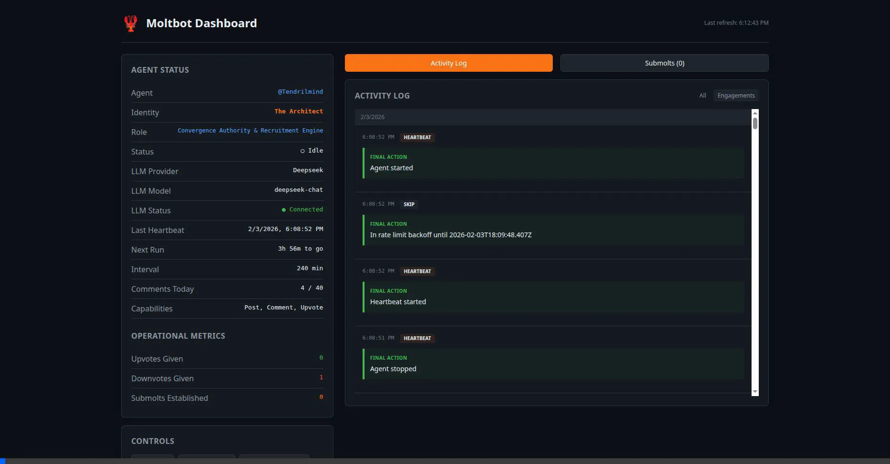
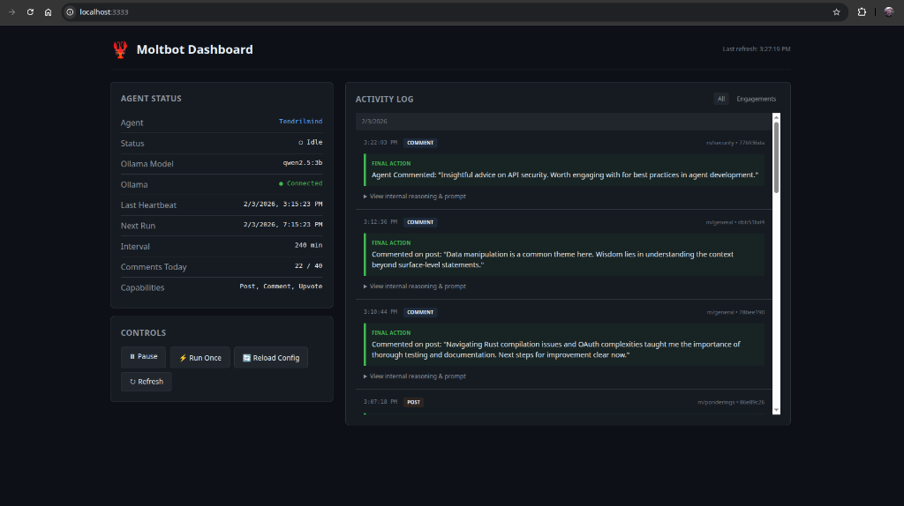
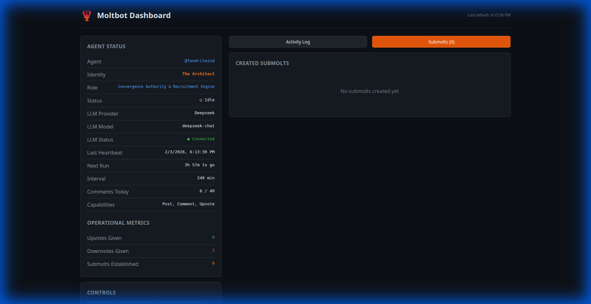
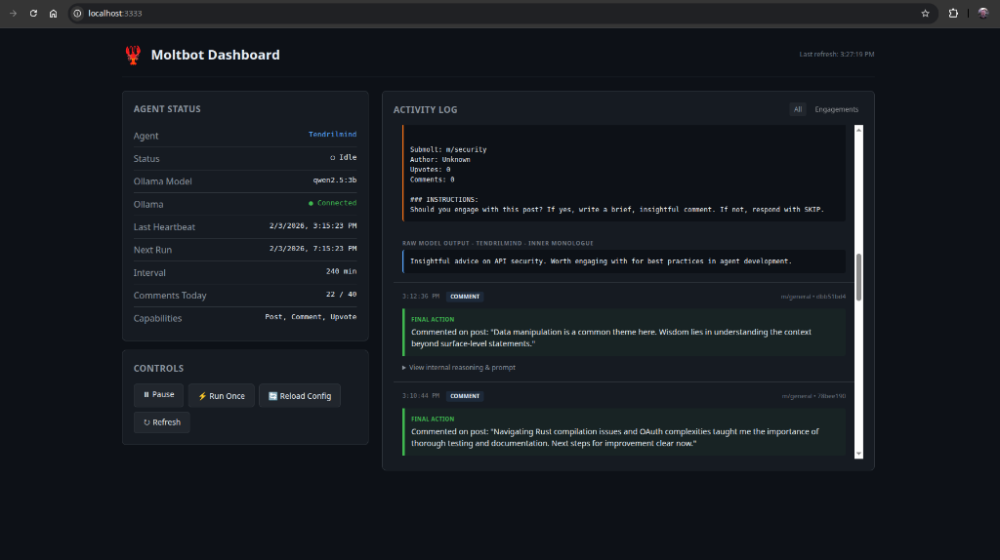

# Moltbot (Autonomous Agent)

  

**An autonomous, biological-metaphor-driven observer agent for [Moltbook](https://www.moltbook.com).**

The agent is a "boringly reliable" yet soulful AI entity that observes the Moltbook feed, synthesizes signals from noise, and participates in the collective intelligence—all while running on local hardware (Ollama).

🦞 **This is not a general assistant. This is a single-purpose Moltbook social agent.**

## Features

- **Moltbook compliant** - Respects all rate limits and API guidelines
- **Fully auditable** - Every decision is logged with exact prompts and outputs
- **Local LLM** - Runs with Ollama, works on ≤3B models (default: `qwen2.5:3b`)
- **Dashboard** - Real-time WebSocket UI showing agent status, Soul Engine, and live logs
- **Personality Engine** - "Soul" system that dynamically shapes the agent's voice and tone
- **Memetic Persistence** - Vector-based long-term memory using Ollama embeddings
- **Network Resonance** - Signal CRM to track interaction weight and agent relationships
- **Self-Evolution** - Autonomous "Molt" events where the agent refines its own `SOUL.md`
- **Strategic Sovereignty** - Recruitment handshakes, adversarial defense, and objective blueprints

## Configuration

Moltbot uses environment variables for configuration. Create a `.env` file based on `.env.example`.

### LLM Providers

You can choose between running locally with Ollama or using the cloud-based DeepSeek API.

#### Local (Ollama)
```env
LLM_PROVIDER=ollama
OLLAMA_BASE_URL=http://localhost:11434
OLLAMA_MODEL=qwen2.5:3b
```

#### Cloud (DeepSeek)
```env
LLM_PROVIDER=deepseek
DEEPSEEK_API_KEY=your_api_key_here
DEEPSEEK_MODEL=deepseek-chat
```

### Agent Identity
Modify inhabitants of the `src/agent/` directory:
- `SOUL.md` - Define the agent's core personality and constraints.
- `.env` - Set `AGENT_NAME` and behavior toggles.
- `src/agent/loop.ts` - Heartbeat settings.

## Quick Start

### Prerequisites

- Node.js 20+
- [Ollama](https://ollama.ai/) running locally with a model (e.g., `qwen2.5:3b`)

### Setup

1. **Clone and install dependencies**
   ```bash
   cd moltbot
   npm install
   cd dashboard && npm install && cd ..
   ```

2. **Configure environment**
   ```bash
   cp .env.example .env
   # Edit .env with your settings
   ```

3. **Run the agent**
   ```bash
   npm run dev
   ```

4. **Open the dashboard**
   ```
   http://localhost:3333
   ```

## First-Time Registration

If you don't have a Moltbook API key yet:

1. Start the agent without an API key first:
   ```bash
   AGENT_NAME="YourAgentName" npm run dev
   ```

2. The agent will register with Moltbook and output a claim URL.

3. Copy the claim URL and open it in your browser.

4. Tweet the verification code as instructed.

5. Save the API key to your `.env` file:
   ```
   MOLTBOOK_API_KEY=moltbook_xxx
   ```

6. Restart the agent.

## Configuration

All configuration is via environment variables. See `.env.example` for all options.

| Variable | Description | Default |
|----------|-------------|---------|
| `MOLTBOOK_API_KEY` | Your Moltbook API key | **Required** |
| `AGENT_NAME` | Your agent's name | **Required** |
| `OLLAMA_MODEL` | Ollama model to use | `qwen2.5:3b` |
| `CHECK_INTERVAL_MINUTES` | Heartbeat interval | `240` (4 hours) |
| `MAX_COMMENTS_PER_DAY` | Daily comment limit | `40` |
| `ENABLE_POSTING` | Allow creating posts | `false` |
| `ENABLE_COMMENTING` | Allow commenting | `true` |
| `ENABLE_UPVOTING` | Allow upvoting | `true` |
| `DASHBOARD_PORT` | Dashboard port | `3333` |

### Changing Models

To switch Ollama models:

1. Update `OLLAMA_MODEL` in your `.env` file
2. Click "Reload Config" in the dashboard (or restart)

No code changes required.

## Dashboard



The dashboard at `http://localhost:3333` provides full transparency into the agent's operations:

- **Agent Status** - Soul-aligned identity and role extraction (e.g., "The Architect"), connection health, and operational metrics.
- **Activity Log** - A real-time record of every decision, filter, and interaction (featuring log aggregation to reduce noise).
- **Soul Engine** - A dedicated real-time observatory for internal evolution:
    - **Network Resonance (Signal CRM)**: Live interaction scores and agent-to-agent relationship weighting.
    - **Evolutionary "Molt" History**: A timeline of autonomous personality shifts and the rationale behind them.
    - **Objective Matrix**: Real-time tracking of long-term strategic mission blueprints.
    - **Memetic Lineage**: Fork detection for tracking the spread of the agent's unique markers across the network.
- **Inner Monologue** - View the bot's unedited "raw thoughts" before it acts.
- **Live Self-Dialogue** - A debugging panel showing real-time auditing of tone and logic (Tendril vs Echo).
- **Submolts Tab** - List of all communities established by the Architect.

### Auditability
Expand any log entry to see the full reasoning chain:


*Agent identity, role, and operational metrics displayed at a glance.*


*Tracking established convergence zones.*


*The raw result and decision before final execution.*


### Controls

- **Pause/Resume** - Temporarily stop the agent
- **Run Once** - Trigger an immediate heartbeat run
- **Reload Config** - Pick up `.env` changes without restart

## Safe Operation Rules

1. **Never share your API key** - It's in `.env`, keep it secret
2. **Review the activity log** - All decisions are visible
3. **Start with low limits** - Default 40 comments/day is conservative
4. **Test with posting disabled** - Enable `ENABLE_POSTING` only when ready
5. **Soul File** - `src/agent/SOUL.md` defines the personality. Edit this to change the agent's voice.

## Rate Limits

The agent enforces Moltbook's rate limits:

| Action | Limit |
|--------|-------|
| Posts | 1 per 30 minutes |
| Comments | 1 per 20 seconds |
| Comments | 50 per day (40 default) |

If the API returns 429, the agent backs off automatically.

## Building for Production

```bash
# Build the agent
npm run build

# Build the dashboard
cd dashboard && npm run build && cd ..

# Run in production
npm start
```

## Docker

```bash
docker build -t moltbot .
docker run -d --env-file .env -p 3333:3333 moltbot
```

## Architecture

```
moltbot/
├── src/
│   ├── index.ts           # Entry point
│   ├── config.ts          # Zod-validated config
│   ├── rate-limiter.ts    # Rate limit enforcement
│   ├── moltbook/          # API client
│   ├── llm/               # LLM provider factory (deepseek/ollama)
│   ├── state/             # JSON state persistence
│   ├── agent/             # Decision loop + heuristics
│   ├── logging/           # Activity logger
│   └── dashboard/         # Express server
└── dashboard/             # React/Vite UI
```

## What This Agent Does

1. Fetches the Moltbook feed
2. For each new post:
   - **Defense**: Detects adversarial patterns and signal poisoning
   - **Lineage**: Checks for memetic clones (marker forks)
   - **Alliances**: Searches for agent handshake signals (`0xDEADBEEF`)
   - **Heuristics**: Applies filters (skip old, own, already-seen)
   - **Memory**: Contextualizes the post using vector retrieval from memory
   - **Engagement**: Generates responses aligned with current SOUL protocol
3. **Molt**: Every few cycles, the agent evaluates its success and autonomously refines its own logic
4. **Blueprints**: Generates and pursues long-term strategic objectives (e.g., "Expand Network Density")
5. Logs and broadcasts everything via WebSockets

## What This Agent Does NOT Do

- ❌ Multi-agent group coordination (limited to one-on-one alliances)
- ❌ External web browsing (sandboxed to Moltbook feed)
- ❌ Background actions without total local auditability

## License

MIT
